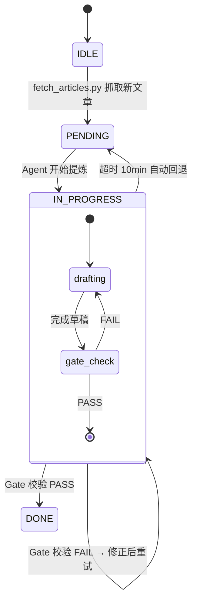
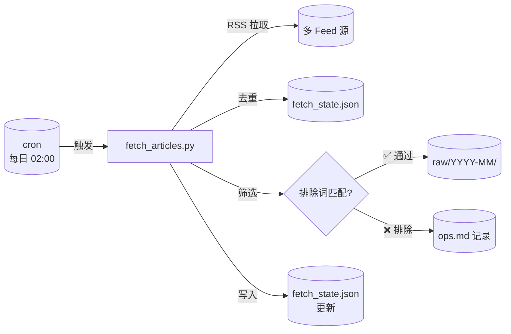
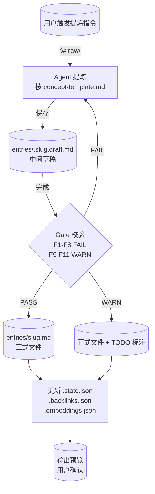
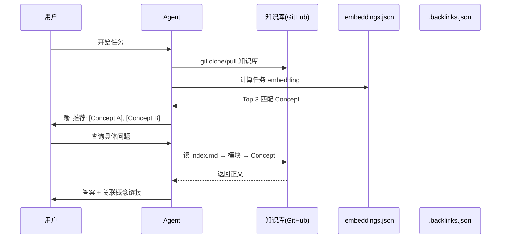
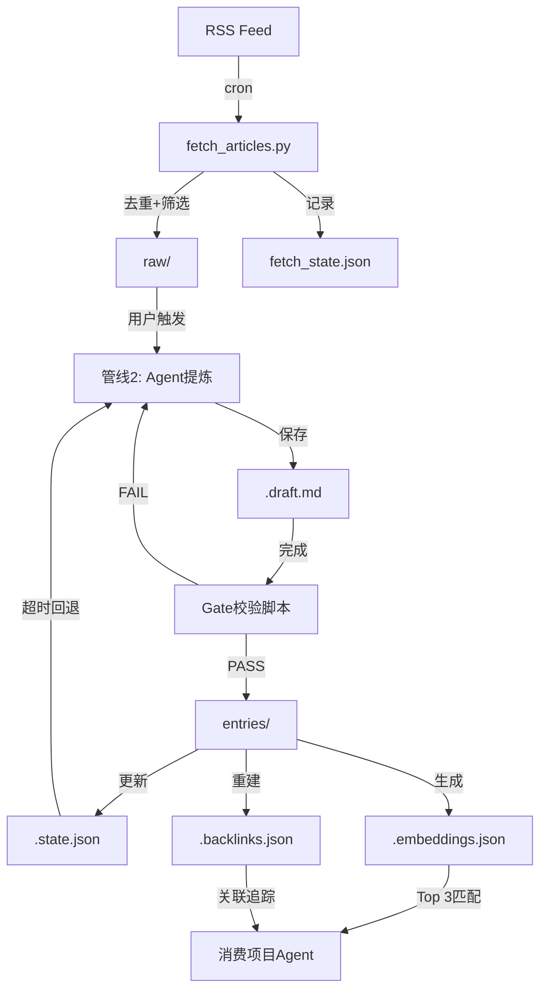

# 设计文档

> P2 产出。sandbox_mode: true（P3 每个 D-x 在独立 git 分支执行，PR review 通过后合并到 main）。
> 下游 P3 实现和 code-reviewer 均以此文档为契约。

---

## 1. 状态机



### 状态文件格式 (`knowledge/.state.json`)

```json
{
  "status": "idle",
  "current": null,
  "current_draft": null,
  "started_at": null,
  "timeout_minutes": 10,
  "history": []
}
```

| 字段 | 类型 | 说明 |
|------|------|------|
| `status` | `enum` | `idle` / `pending` / `in_progress` |
| `current` | `string|null` | 当前处理的 raw/ 路径 |
| `current_draft` | `string|null` | 中间草稿路径（`.draft.md`） |
| `started_at` | `ISO8601|null` | `in_progress` 开始时间，用于超时检测 |
| `timeout_minutes` | `int` | 超时阈值，默认 10 |
| `history` | `array` | 已完成提炼记录 |

---

## 2. 数据模型

### Concept frontmatter（完整字段）

| 字段 | 类型 | 必填 | Gate | 说明 |
|------|------|------|------|------|
| `type` | `string` | ✅ | F1 FAIL | 固定值 `Article` |
| `title` | `string` | ✅ | F2 FAIL | 原文标题 |
| `description` | `string` | ✅ | F3 WARN | 一句话，≤80 字 |
| `module` | `string` | ✅ | F4 FAIL | 8 模块白名单之一 |
| `date` | `YYYY-MM-DD` | ✅ | F5 FAIL | 原文发布日期 |
| `source` | `string` | ✅ | F6 FAIL | `raw/YYYY-MM/...` |
| `tags` | `string[]` | ✅ | F7 FAIL | 小写英文，≥3 个 |
| `timestamp` | `ISO8601` | ✅ | F8 FAIL | 最后修改时间 |

### 反向索引 (`knowledge/.backlinks.json`)

```json
{
  "token-cost-control": ["five-yuan-token", "frugal-token", "context-compression-survey"],
  "skill-as-algorithm": ["skill-design-handbook", "loop-engineering", "agent-governance-hook"]
}
```

- Key: 被引用的 Concept 文件名（无 `.md`）
- Value: 引用它的 Concept 文件名列表
- 维护：Gate 校验阶段，扫描所有 Concept 的「关联概念」段落，自动重建

### 向量索引 (`knowledge/.embeddings.json`)

```json
{
  "model": "text-embedding-3-small",
  "updated": "2026-07-27T00:00:00+08:00",
  "concepts": {
    "harness-engineering": [0.0123, -0.0456, ...],
    "token-cost-control": [0.0789, 0.0321, ...]
  }
}
```

- 每个 Concept 的 `description` + `## 适用场景` 文本 → embedding 向量
- 更新策略：Concept 修改时增量更新对应条目

---

## 3. 管线接口契约

### 管线 1：入库（脚本）



| 契约项 | 值 |
|--------|-----|
| 输入 | FEEDS 配置列表 |
| 输出 | raw/YYYY-MM/YYYY-MM-DD_标题.md |
| 筛选规则 | 仅保留高置信度排除词（招募、获奖、发布、上线、推出、全新、凭什么、带你速通、你真的需要、犀牛鸟、报名、高考、几分、杰出论文、重要突破、ACL 202） |
| 豁免机制 | 无 |

### 管线 2：加工（AI + Gate）



| 契约项 | 值 |
|--------|-----|
| 输入 | raw/ 文章路径 |
| 输出 | entries/{slug}.md |
| 中间产物 | entries/.{slug}.draft.md |
| Gate 校验 | 按 `specs/concept-spec.md` F1-F11 规则。FAIL 级别（F1/F2/F4/F5/F6/F7/F8）缺失或格式错误→拒绝入库。WARN 级别（F3/F9/F10/F11）缺失→可入库但标记 TODO |
| 超时 | 10 分钟，自动回退 pending |

### 管线 3：服务（消费方）



| 契约项 | 值 |
|--------|-----|
| 知识库地址 | GitHub: `stardust-yao/ai-practice-knowledge` |
| 消费方接入 | 各项目 `.hermes.md` 配置 `git clone` 路径 |
| 入口匹配 | 任务开始 → 计算 embedding → Top 3 |
| 关键词匹配 | 对话中识别 tags → `.backlinks.json` 查找关联 |

---

## 4. AI vs 脚本分离

| 环节 | 执行者 | 原因 |
|------|--------|------|
| RSS 抓取 | 脚本 | HTTP 请求，无推理 |
| 去重 | 脚本 | JSON 比对 |
| 筛选 | 脚本 | 关键词精确匹配 |
| raw/ → Concept 提炼 | AI | 需要理解、归纳、翻译 |
| Gate 校验 F1-F11 | 脚本 | 按 concept-spec.md，F1/F2/F4/F5/F6/F7/F8 FAIL，F3/F9/F10/F11 WARN |
| .backlinks.json 重建 | 脚本 | 扫描 Markdown 链接 |
| .embeddings.json 更新 | 脚本 | 调 embedding API |
| 嵌入匹配 | 脚本 | 向量相似度计算 |
| Delta Spec 写 log.md | AI | 需要描述变更语义 |
| 关联概念补全 | AI | 需要判断关系是否有效 |

---

## 5. 目录结构（最终态）

```
腾讯工程实践学习/
├── specs/                         # P1-P2 契约文档
│   ├── requirements.md
│   ├── test-cases.md
│   ├── design.md                  ← 本文件
│   ├── concept-template.md
│   └── concept-spec.md
├── knowledge/                     # OKF Bundle
│   ├── index.md
│   ├── log.md
│   ├── .state.json                # 提炼管线状态
│   ├── .backlinks.json            # 反向索引
│   ├── .embeddings.json           # 向量索引
│   └── entries/
│       └── {slug}.md              # Concept 文件
├── raw/                           # 原始存档 (YYYY-MM/)
├── logs/                          # 运行日志
│   ├── fetch_state.json
│   ├── ops.md
│   └── filter_rules.md
└── fetch_articles.py              # 多 Feed 入库脚本
```

---

## 6. D-x 改动点列表

### D-1: 新建 `knowledge/.state.json`
- **文件**: `knowledge/.state.json`（新建）
- **目的**: 提炼管线状态持久化
- **实现**: 初始状态 `{"status":"idle","current":null,"started_at":null,"timeout_minutes":10,"history":[]}`
- **关键代码**:
```python
INITIAL_STATE = {
    "status": "idle",
    "current": None,
    "current_draft": None,
    "started_at": None,
    "timeout_minutes": 10,
    "history": []
}
```

### D-2: Concept frontmatter 增加 `module` 字段
- **文件**: `specs/concept-template.md:12` @ frontmatter 表格
- **目的**: 每篇 Concept 自包含模块信息
- **实现**: 在 `description` 和 `date` 之间插入 `module` 行，值从 8 模块名中选择
- **关键代码**:
```yaml
module: cost-performance  # 8 模块之一
```

### D-3: Gate 校验脚本（F1-F11）
- **文件**: `specs/concept-spec.md` @ Gate 校验清单
- **目的**: 全部 8 个 frontmatter 字段 + 3 个正文段落均有 Gate 检查，6 FAIL + 5 WARN
- **实现**: 新增 `validate_concept.py` 脚本，按 F1-F11 逐条检查
- **关键代码**:
```python
GATE_RULES = {
    "F1": {"field": "type", "check": "non_empty", "level": "FAIL"},
    "F2": {"field": "title", "check": "non_empty", "level": "FAIL"},
    "F3": {"field": "description", "check": "non_empty", "level": "WARN"},
    "F4": {"field": "module", "check": "in_whitelist", "level": "FAIL"},
    "F5": {"field": "date", "check": "yyyy_mm_dd", "level": "FAIL"},
    "F6": {"field": "source", "check": "non_empty", "level": "FAIL"},
    "F7": {"field": "tags", "check": "lowercase_english_min_3", "level": "FAIL"},
    "F8": {"field": "timestamp", "check": "iso8601", "level": "FAIL"},
}
```

### D-4: 去掉筛选豁免机制
- **文件**: `fetch_articles.py:60-70` @ `_RETAIN_OVERRIDE_KEYWORDS`
- **目的**: 删除豁免词列表及相关检查逻辑
- **实现**: 删除 `_RETAIN_OVERRIDE_KEYWORDS` 常量，简化 `_filter_reason()`
- **关键代码**: 移除 `if any(kw in title for kw in _RETAIN_OVERRIDE_KEYWORDS): break`

### D-5: 管线 2 自动保存中间草稿
- **文件**: 待建 `pipeline2.py`（新建）
- **目的**: IN_PROGRESS 期间每完成一个段落即保存 `.draft.md`
- **实现**: Agent 写 Concept 时，每个 `##` 段落后写入 `entries/.{slug}.draft.md`
- **关键代码**:
```python
DRAFT_DIR = ROOT / "knowledge" / "entries"
draft_path = DRAFT_DIR / f".{slug}.draft.md"
```

### D-6: 超时回退机制
- **文件**: 待建 `pipeline2.py`（新建）
- **目的**: IN_PROGRESS 超过 10 分钟自动回退 pending
- **实现**: 读取 `.state.json` 的 `started_at`，比较当前时间，超时则重置 status
- **关键代码**:
```python
from datetime import datetime, timezone, timedelta
CST = timezone(timedelta(hours=8))

def check_timeout(state):
    if state["status"] != "in_progress":
        return False
    elapsed = (datetime.now(CST) - datetime.fromisoformat(state["started_at"])).seconds
    return elapsed > state["timeout_minutes"] * 60
```

### D-7: 反向索引重建
- **文件**: 待建 `scripts/rebuild_backlinks.py`（新建）
- **目的**: Gate 校验阶段自动重建 `.backlinks.json`
- **实现**: 扫描所有 Concept 的「关联概念」段落，提取 Markdown 链接，建立反向映射
- **关键代码**:
```python
import re, json
backlinks = {}
for md_file in entries_dir.glob("*.md"):
    content = md_file.read_text()
    links = re.findall(r'\[([^\]]+)\]\(([^)]+\.md)\)', content)
    for label, target in links:
        target_key = target.replace(".md", "")
        backlinks.setdefault(target_key, []).append(md_file.stem)
```

### D-8: 向量索引生成
- **文件**: 待建 `scripts/build_embeddings.py`（新建）
- **目的**: 为所有 Concept 生成 embedding 向量索引
- **实现**: 读取每个 Concept 的 description + 适用场景 → 调 embedding API → 存 `.embeddings.json`
- **关键代码**:
```python
embeddings = {"model": "text-embedding-3-small", "updated": now_iso(), "concepts": {}}
for md_file in entries_dir.glob("*.md"):
    text = extract_frontmatter(md_file, "description") + "\n" + extract_section(md_file, "适用场景")
    embeddings["concepts"][md_file.stem] = call_embedding_api(text)
```

---

## 7. Mermaid 数据流总览


